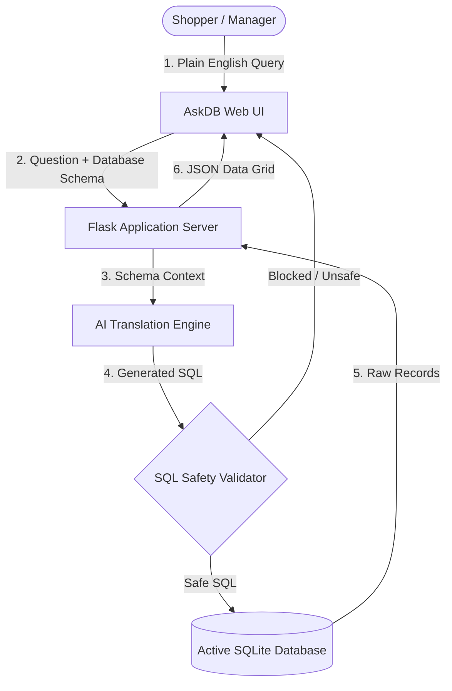

# AskDB — AI-Powered Natural Language Database Assistant

AskDB is a modern, premium SaaS web application designed to help business teams, managers, and analysts query SQL databases using plain English. No SQL knowledge is required. AskDB translates natural language questions into safe, read-only SQL queries, displays results in an interactive data grid, and allows instant exporting to CSV and Excel files.

---

## Features

- **Plain English Queries**: Type queries like *"Top 5 customers by order amount"* or *"Average product rating per category"* and get answers immediately.
- **100% Read-Only Safety**: An embedded SQL validation engine intercepts and blocks destructive statements (e.g., `DROP`, `DELETE`, `UPDATE`, `INSERT`).
- **Multi-Database Workspace**: Upload custom SQLite databases (.db, .sqlite, .sqlite3) and manage them in a clean layout.
- **Pre-loaded Sample Dataset**: Instantly explore the workspace with a pre-loaded, rich E-Commerce Sample Database.
- **Interactive Data Exports**: Download tables directly as clean CSV files or multi-sheet Excel workbooks.
- **Bookmarks & History**: Save frequently run queries and view complete query execution history.
- **Neo-Brutalist Design System**: Responsive, clean interface optimized for both desktop and mobile viewports, designed using solid borders and professional Space Grotesk typography.

---

## Architecture & Flow



---

## Repository Structure

```
ASKdb/
├── database/                    # SQLite databases (.db metadata and dataset stores)
│   ├── askdb_metadata.db        # Metadata db tracking user registrations and database links
│   └── ecommerce_sample.db      # Preloaded rich e-commerce sample database
├── sample_data/                 # Sample generation files
│   └── create_sample_db.py      # Python script to generate ecommerce_sample.db from scratch
├── static/                      # Static client assets
│   ├── css/
│   │   └── style.css            # Unified global stylesheet (Neo-Brutalist theme variables)
│   ├── js/
│   │   ├── app.js               # Main query execution and workspace interactivity
│   │   └── ui.js                # Theme toggling, responsive nav scrolls, and alerts
│   └── images/                  # Page image assets
├── templates/                   # HTML templates (Flask Jinja2)
│   ├── base.html                # Global layout (Brand header, responsive navs, drawers)
│   ├── landing.html             # SaaS overview landing page
│   ├── login.html / signup.html # Themed signup and login portals
│   ├── databases.html           # File upload manager and wizard guide
│   └── workspace.html           # Live query console area
├── utils/                       # Core back-end utilities
│   ├── db_helper.py             # SQLite query executors and schemas reader
│   └── sql_parser.py            # Natural Language translator and safety validation logic
├── app.py                       # Main Flask server runner
└── requirements.txt             # Project python dependencies configuration
```

---

## Getting Started

### Prerequisites
- Python 3.8 or higher installed on your system.

### 1. Clone & Navigate
Clone the repository and enter the directory:
```bash
git clone https://github.com/your-username/ASKdb.git
cd ASKdb
```

### 2. Create Virtual Environment
Create and activate a Python virtual environment:
```bash
# Windows
python -m venv venv
venv\Scripts\activate

# macOS/Linux
python3 -m venv venv
source venv/bin/activate
```

### 3. Install Dependencies
Install all package configurations:
```bash
pip install -r requirements.txt
```

### 4. Run the Dev Server
Launch the Flask development server:
```bash
python app.py
```
The server will boot up locally at: **`http://127.0.0.1:5000/`**

---

## Preloaded E-Commerce Sample Database

For convenience, a representative e-commerce database is pre-loaded inside `database/ecommerce_sample.db`. 

### Table Schemas:
1. **`customers`**: Shoe shopper profiles (`first_name`, `last_name`, `email`, `city`, `join_date`, `is_active`).
2. **`products`**: Item catalog records (`name`, `category`, `price`, `stock`, `rating`, `created_date`).
3. **`orders`**: Transaction checkouts (`customer_id`, `order_date`, `total_amount`, `status`).
4. **`order_items`**: Order line details (`order_id`, `product_id`, `quantity`, `unit_price`).

### Export Formats:
- **Raw SQL dump**: Recreate the database structure and 600+ records in any SQLite GUI using [ecommerce_sample.sql](ecommerce_sample.sql).
- **Excel Spreadsheet**: Browse raw table sheets directly via [ecommerce_sample.xlsx](ecommerce_sample.xlsx).

---

## Security & Safe Queries
AskDB uses an inline AST analyzer to check all translation results. Queries targeting key system functions or using keywords such as `DROP`, `DELETE`, `UPDATE`, `INSERT`, `ALTER`, `REPLACE`, `CREATE`, or executing nested administrative SQLite functions are automatically blocked, protecting your data files from modifications.

---

## Live Demo

https://askdb-ctm3.onrender.com
